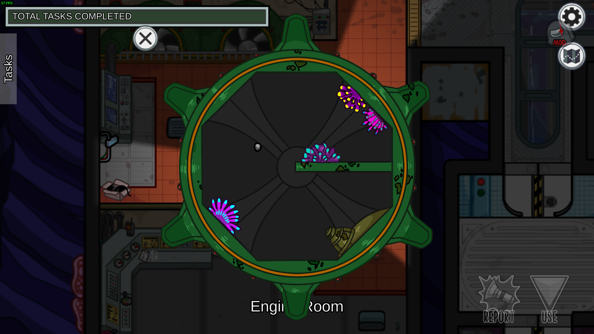
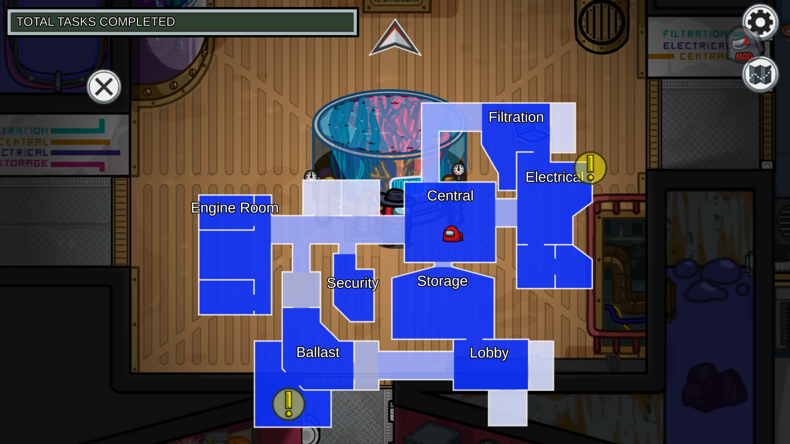

# Submerged

Submerged is a mod for Among Us which adds a new map into the game.

## Features

- Multiple floors and elevators
- Over 25 new custom tasks
- 4 new sabotages
- New mechanics
- Works on official servers

## Images and Videos

Click to expand

### Map Guide

### Trailer

[See the trailer on YouTube](http://www.youtube.com/watch?v=gAX_mDOX4Pc)

### Screenshots

# Releases

Submerged is compatible with desktop releases of Among Us. This includes Steam, Epic Games and itch.io. We do not support cracked versions of Among Us.

The table below lists the most recent Submerged release for each Among Us version after `v2022.3.29` (for desktop platforms only). The changelog for each version can be found under the [Releases](https://github.com/SubmergedAmongUs/Submerged/releases) tab.

|                                       Among Us Version                                        | Submerged Version |                                        Links                                        |
|:---------------------------------------------------------------------------------------------:|:-----------------:|:-----------------------------------------------------------------------------------:|
|                                    `v17.0.1` `v17.0.0`                                     |   `v2025.10.22`   | [Download](https://github.com/SubmergedAmongUs/Submerged/releases/tag/v2025.10.22/) |
|                 `v16.1.0` `v16.0.5` `v16.0.3` `v16.0.2` `v16.0.0`                 |    Unavailable    |                                          -                                          |
|                 `v2024.11.26` `v2024.10.29` `v2024.9.4` `v2024.8.13`                 |   `v2025.1.30`    | [Download](https://github.com/SubmergedAmongUs/Submerged/releases/tag/v2025.1.30/)  |
|                                         `v2024.6.18`                                          |    `v2024.8.1`    |  [Download](https://github.com/SubmergedAmongUs/Submerged/releases/tag/v2024.8.1/)  |
|                                  `v2024.6.4` `v2024.3.5`                                   |   `v2024.3.25`    | [Download](https://github.com/SubmergedAmongUs/Submerged/releases/tag/v2024.3.25/)  |
|                                         `v2023.11.28`                                         |   `v2023.11.29`   | [Download](https://github.com/SubmergedAmongUs/Submerged/releases/tag/v2023.11.29/) |
|                                         `v2023.10.24`                                         |   `v2023.11.2`    | [Download](https://github.com/SubmergedAmongUs/Submerged/releases/tag/v2023.11.2/)  |
|                                 `v2023.7.12` `v2023.7.11`                                  |    `v2023.8.2`    |  [Download](https://github.com/SubmergedAmongUs/Submerged/releases/tag/v2023.8.2/)  |
| `v2023.6.27` `v2023.6.13` `v2023.3.28` `v2023.2.28` `v2022.12.14` `v2022.12.8` |    Unavailable    |                                          -                                          |
|                                         `v2022.10.25`                                         |   `v2022.10.26`   | [Download](https://github.com/SubmergedAmongUs/Submerged/releases/tag/v2022.10.26/) |
|                                         `v2022.10.18`                                         |    Unavailable    |                                          -                                          |
|                 `v2022.9.20` `v2022.8.25` `v2022.8.24` `v2022.8.23`                  |   `v2022.8.26`    | [Download](https://github.com/SubmergedAmongUs/Submerged/releases/tag/v2022.8.26/)  |
|                                 `v2022.7.12` `v2022.6.21`                                  |   `v2022.6.23`    | [Download](https://github.com/SubmergedAmongUs/Submerged/releases/tag/v2022.6.23/)  |
|                                 `v2022.4.19` `v2022.3.29`                                  |   `v2022.6.12`    | [Download](https://github.com/SubmergedAmongUs/Submerged/releases/tag/v2022.6.12/)  |

# Dependencies

Submerged depends on the following mods and modding tools in order to function properly:

| Mod                                                       | Version           |
|-----------------------------------------------------------|-------------------|
| [BepInEx](https://builds.bepinex.dev/projects/bepinex_be) | `v6.0.0-be.735`   |
| [Reactor](https://github.com/nuclearpowered/reactor)      | `v2.5.0` or later |

> [!Note]
> If you are using the Microsoft Store version of Among Us, you will need to download the `Unity (IL2CPP) for Windows (x64) games` version of BepInEx. Otherwise, you will need to download the `Unity (IL2CPP) for Windows (x86) games` version.

# Installation

**This mod is not compatible with mobile or console versions of Among Us.**

This mod is only guaranteed to work on Windows operating systems. We have no plans on ensuring compatibility with Linux-based operating systems or Mac.

This mod has been tested and works with the Steam, Epic, itch.io and Microsoft Store versions of Among Us. We do not support or endorse using a pirated version of Among Us with Submerged.

## Installation Steps

1. Download the correct ZIP [release](#releases) based on your Among Us version.
2. Navigate to your Among Us installation directory.
3. Extract the downloaded files there. Ensure that the `BepInEx` folder is located in the same folder as the `Among Us.exe` file (Check screenshot below).
   

4. Run the game (Please note that the first launch might take some time).

Alternatively, if you are already using other mods or already have BepInEx installed, you can download the DLL file directly and place it in `BepInEx/plugins`.

# Localization

Submerged is available in the languages listed below. If you would like to help translate Submerged to one of the languages listed below or want to correct a translation, please [open an issue](https://github.com/SubmergedAmongUs/Submerged/issues/new/choose/) or contact us at `submergedamongus@gmail.com`.

| Language                | ❔  |              Status               |
|-------------------------|:--:|:---------------------------------:|
| English                 | ✅  |                 -                 |
| Deutsch                 | 🟡 |       Partially Translated        |
| Español                 | 🟡 |       Partially Translated        |
| Français                | 🟡 |       Partially Translated        |
| Italiano                | 🟡 |       Partially Translated        |
| Nederlands              | 🟡 |       Partially Translated        |
| Português (Brasil)      | 🟡 |       Partially Translated        |
| Русский                 | 🟡 |       Partially Translated        |
| 日本語                     | 🟡 |       Partially Translated        |
| 简体中文                    | 🟡 |       Partially Translated        |
| 繁體中文                    | 🟡 |       Partially Translated        |
| Bisaya                  | ❌  |          Not Translated           |
| Español (Latinoamérica) | ❌  | Not Translated (Using Español) |
| Gaeilge                 | ❌  |          Not Translated           |
| Português               | ❌  |          Not Translated           |
| 한국어                     | ❌  |          Not Translated           |

# Compatibility

This mod tries to touch as little as possible in order to be compatible with as many other mods as possible. However, if you encounter any issues while using Submerged alongside other mods, **please contact the developers of those mods first** before reaching out to us, as we will only investigate Submerged-related issues and not issues related to other mods.

If you are a mod developer, the [FOR MOD DEVELOPERS.md](./.github/FOR%20MOD%20DEVELOPERS.md) file includes more information on how to make your mod compatible with Submerged.

Submerged is compatible both with official servers and [Impostor](https://github.com/Impostor/Impostor) servers.

# Contributing Guidelines

Any and all contributions are welcome, but please keep in mind that Submerged is a finished project. We will not accept any new major features unless they are very cool 😎. If you want to add new features, please open an issue discussing your proposed changes before creating a pull request.

Additionally feel free to [open an issue](https://github.com/SubmergedAmongUs/Submerged/issues/new/choose/) if you have a feature request, want to report a bug, or basically anything else.

All pull request contributors are required to sign a [CLA](https://gist.github.com/Alexejhero/740d681de944b21948edd940a23f3ff1) (a bot will comment on opened pull requests with instructions).

# License

This mod is licensed under a custom license. Please check [LICENSE.md](LICENSE.md) for more information.

_This mod is not affiliated with Among Us or Innersloth LLC, and the content contained therein is not endorsed or otherwise sponsored by Innersloth LLC. Portions of the materials contained herein are property of Innersloth LLC. © Innersloth LLC._

For business inquiries, please contact us at `submergedamongus@gmail.com`.

# Credits

- Project Lead
    - [5up](https://twitch.tv/5up/)
- Developers
    - [Alexejhero](https://github.com/Alexejhero/)
    - [arctic_zeph](https://twitter.com/arctic_zeph/)
    - [probablyadnf](https://github.com/simonkellly/)
- Map Design
    - [Axyn](https://twitter.com/itsAxyn/)
    - [Blaustoise](https://twitter.com/blaustoise/)
- Artists
    - [colerobin_](https://twitter.com/colerobin_)
    - [flipsonthemoon](https://twitter.com/flipsonthemoon/)
    - [mushrium](https://twitter.com/mushrium/)
    - [sabimrtn](https://twitter.com/sabimrtn/)
    - [theinkpages](https://www.instagram.com/theinkpages/)
    - [xiiyta](https://twitter.com/xiiyta/)
- Contributors
    - [cybershard](https://github.com/cybershard/)
    - [js6pak](https://github.com/js6pak)
    - [Sanae6](https://twitter.com/Sanae6k/)
    - [XtraCube](https://github.com/xtracube/)
- Additional Art
    - [acronmd](https://twitter.com/acronmd/)
    - [QueenPb](https://twitter.com/QueenTamandua/)
- Translators
    - Dekokiyo - 日本語
    - ItsNiceCraft - Deutsch
    - MissJukebox - Español
    - Monid73 - Русский
    - PENGUN - Italiano
    - RevoLou - Português do Brasil
    - RobinRMC - Nederlands
    - SPRLC - Français
    - ねろちゃん - 日本語
    - 阿龍DragonTw - 繁體中文
    - 黑客Hecker - 简体中文
