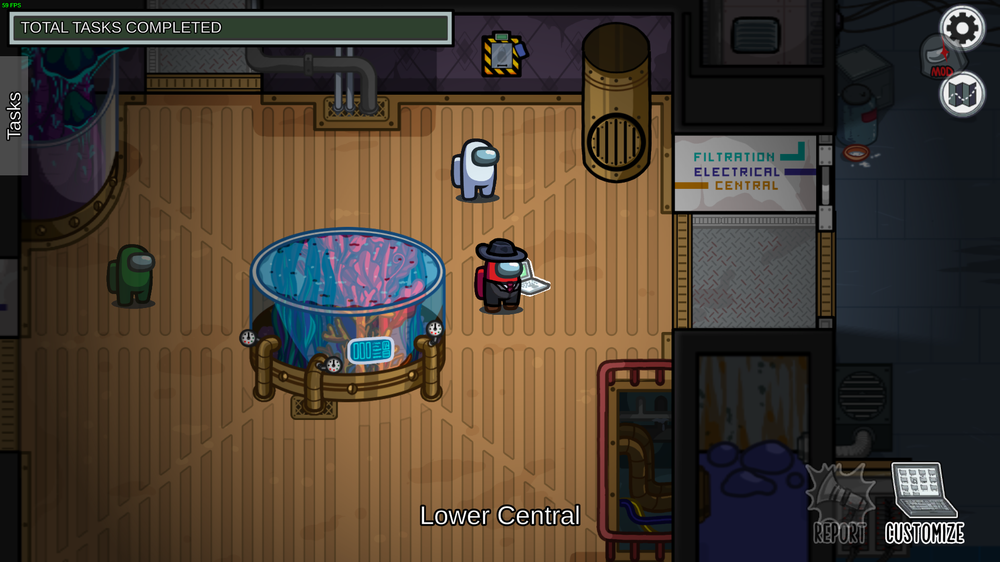
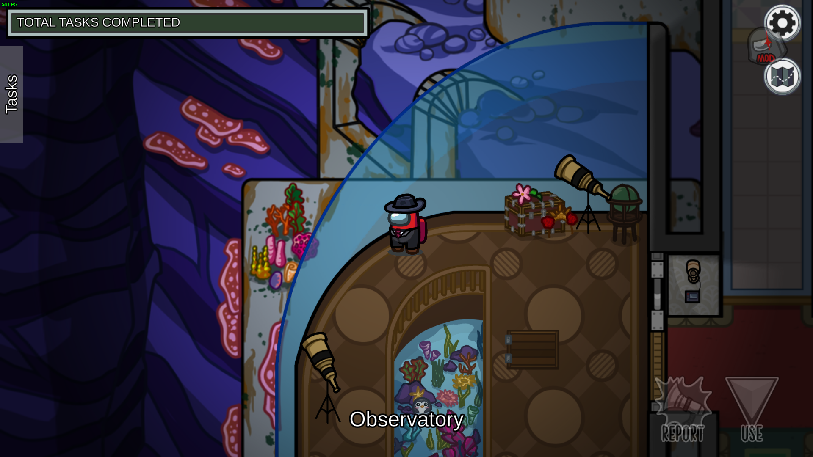
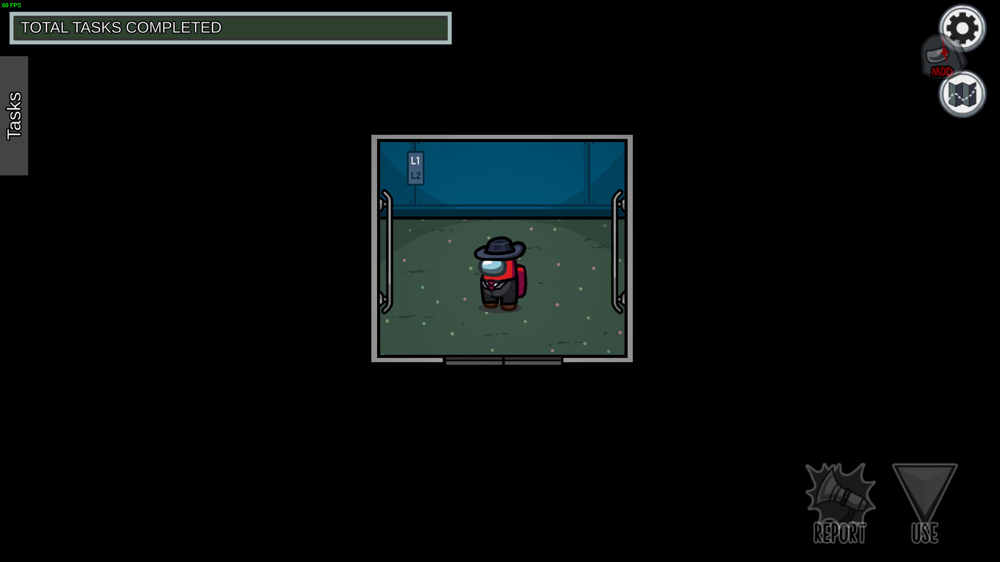
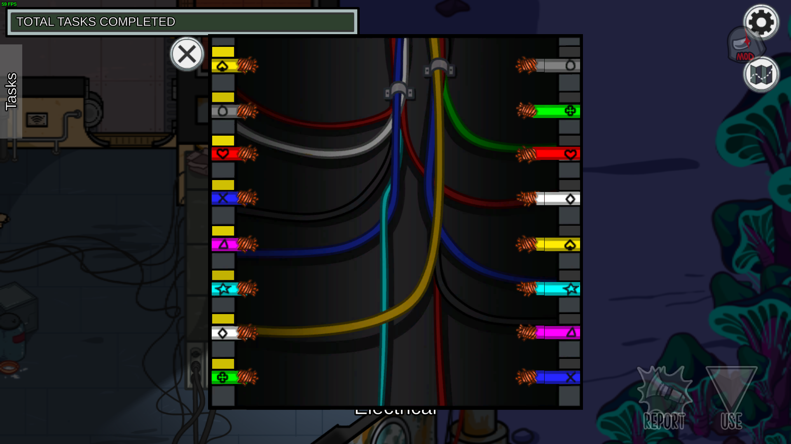
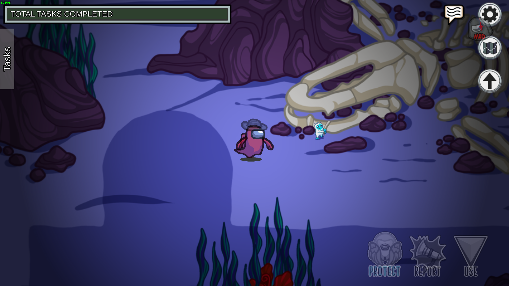
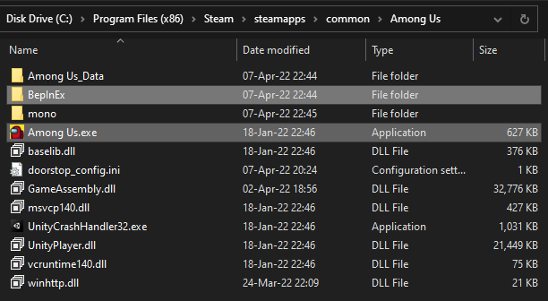

# Submerged

Submerged is a mod for Among Us which adds a new map into the game.

## Features

- Multiple floors and elevators
- Over 25 new custom tasks
- 4 new sabotages
- New mechanics
- Works on official servers

## Screenshots and Videos

Click to expand

  
[See the trailer on YouTube](http://www.youtube.com/watch?v=gAX_mDOX4Pc)

# Releases

Submerged is compatible with desktop releases of Among Us. This includes Steam, Epic Games and Itch.io. We do not support cracked versions of Among Us.

The table below lists the most recent Submerged release for each Among Us version after `v2022.3.29` (for desktop platforms only). The changelog for each version can be found under the [Releases](https://github.com/SubmergedAmongUs/Submerged/releases) tab.

| Among Us Version | Submerged Version | Links |
|:-:|:-:|:-:|
| `v2022.10.25` | `v2022.10.26` | [Download](https://github.com/SubmergedAmongUs/Submerged/releases/tag/v2022.10.26/) |
| `v2022.10.18` | - | Unavailable |
| `v2022.9.20` `v2022.8.25` `v2022.8.24` `v2022.8.23` | `v2022.8.26` | [Download](https://github.com/SubmergedAmongUs/Submerged/releases/tag/v2022.8.26/) |
| `v2022.7.12` `v2022.6.21` | `v2022.6.23` | [Download](https://github.com/SubmergedAmongUs/Submerged/releases/tag/v2022.6.23/) |
| `v2022.4.19` `v2022.3.29` | `v2022.6.12` | [Download](https://github.com/SubmergedAmongUs/Submerged/releases/tag/v2022.6.12/) |

# Compatibility With Other Mods

Note: Using Submerged with any other mods might cause bugs or issues, unless the developers of the those mods have ensured that their mod is compatible with Submerged. If you encounter problems while using Submerged with other mods, please contact the developers of those mods.

| Mod | ❔ | Status |
|-|:-:|:-:|
| [Reactor](https://github.com/nuclearpowered/reactor) | 🔗 | Required |
| [BetterTownOfUs](https://github.com/VincentVision/BetterTownOfUs) | ✅ | Supported |
| [ExtremeRoles](https://github.com/yukieiji/ExtremeRoles/) | ✅ | Supported |
| [LasMonjas](https://github.com/KiraYamato94/LasMonjas/) | ✅ | Supported |
| [TheOtherRoles](https://github.com/Eisbison/TheOtherRoles) | ✅ | Supported |
| [TheOtherRoles-GM-Haoming](https://github.com/haoming37/TheOtherRoles-GM-Haoming) | ✅ | Supported |
| [Town-Of-Us-R](https://github.com/eDonnes124/Town-Of-Us-R) | ✅ | Supported |
| [BetterCrewLink](https://github.com/OhMyGuus/BetterCrewLink) | 🟢 | Compatible (Partially Supported) |
| [RegionInstall](https://github.com/miniduikboot/Mini.RegionInstall) | 🟢 | Compatible |

_If you are aware of the compatibility status of any mods not in this list, please let us know by [opening an issue](https://github.com/SubmergedAmongUs/Submerged/issues/new/choose/) or contacting us at `submergedamongus@gmail.com`._

If you are a mod developer, the [FOR MOD DEVELOPERS.md](./FOR%20MOD%20DEVELOPERS.md) file includes more information on how to make your mod compatible with Submerged. If you need any help with compatibility patches, feel free to contact us on Discord. You may also include and redistribute Submerged with your mod, under the terms of the [license](LICENSE.md).

# Compatibility With Servers

| Server | ❔ | Status |
|-|:-:|:-:|
| Officials | ✅ | Supported |
| [Impostor](https://github.com/Impostor/Impostor/) | ✅ | Supported |

# Installation

**This mod is not compatible with mobile or console versions of Among Us.**

This mod is only guaranteed to work on Windows operating systems. We have no plans on ensuring compatibility with Linux-based operating systems or Mac.

This mod has been tested and works with the Steam, Epic and itch.io versions of Among Us. We do not support or endorse using a pirated version of Among Us with Submerged. 

## Installation Steps

1. Download the correct ZIP [release](#releases) based on your Among Us version.
2. Navigate to your Among Us installation directory.
3. Extract the downloaded files there. Ensure that the `BepInEx` folder is located in the same folder as the `Among Us.exe` file (Check screenshot below).

4. Run the game (Please note that the first launch might take some time).

Alternatively, if you are already using other mods or already have BepInEx installed, you can download the DLL file directly and place it in `BepInEx/plugins`.

# Localization

Submerged is available in the languages listed below. If you would like to help translate Submerged to one of the languages listed below or want to correct a translation, please [open an issue](https://github.com/SubmergedAmongUs/Submerged/issues/new/choose/) or contact us at `submergedamongus@gmail.com`.

| Language | ❔ | Status |
|-|:-:|:-:|
| English | ✅ | - |
| Deutsch | ✅ | Fully Translated |
| Español | ✅ | Fully Translated |
| Français | ✅ | Fully Translated |
| Nederlands | ✅ | Fully Translated |
| Português (Brasil) | ✅ | Fully Translated |
| Русский | ✅ | Fully Translated |
| 日本語 | ✅ | Fully Translated |
| 简体中文 | ✅ | Fully Translated |
| 繁體中文 | ✅ | Fully Translated |
| Bisaya | ❌ | Not Translated |
| Español (Latinoamérica) | ❌ | Not Translated (Using Español) |
| Gaeilge | ❌ | Not Translated |
| Italiano | ❌ | Not Translated |
| Português | ❌ | Not Translated |
| 한국어 | ❌ | Not Translated |

# Contributing Guidelines

We are not accepting any contributions to Submerged at the moment, but you can [open an issue](https://github.com/SubmergedAmongUs/Submerged/issues/new/choose/) if you have a feature request, want to report a bug, or basically anything else. 

## Why Not Open-Source?

While we would love to open-source Submerged, unfortunately we *__cannot__* do that at the moment.

# License

This mod is licensed under a custom license. Please check [LICENSE.md](LICENSE.md) for more information.

_This mod is not affiliated with Among Us or Innersloth LLC, and the content contained therein is not endorsed or otherwise sponsored by Innersloth LLC. Portions of the materials contained herein are property of Innersloth LLC. © Innersloth LLC._

For business inquiries, please contact us at `submergedamongus@gmail.com`.

# Credits

- Project Lead
  - [5up](https://twitch.tv/5up/)
- Developers
  - [AlexejheroYTB](https://twitter.com/AlexejheroYTB/)
  - [arctic_zeph](https://twitter.com/arctic_zeph/)
  - [associatedlogos](https://twitter.com/associatedlogos/)
- Map Design
  - [Axyn](https://twitter.com/itsAxyn/)
  - [Blaustoise](https://twitter.com/blaustoise/)
- Artists
  - [colerobin_](https://twitter.com/colerobin_)
  - [flipsonthemoon](https://twitter.com/flipsonthemoon/)
  - [mushrium](https://twitter.com/mushrium/)
  - [sabimrtn](https://twitter.com/sabimrtn/)
  - [theinkpages](https://www.instagram.com/theinkpages/)
  - [xiiyta](https://twitter.com/xiiyta/)
- Technical Support
  - [cybershard](https://github.com/cybershard/)
  - [Sanae6](https://twitter.com/Sanae6k/)
- Additional Art
  - [acronmd](https://twitter.com/acronmd/)
- Translators
  - [Dekokiyo](https://twitter.com/DekoKiyomori) - 日本語
  - [ItsNiceCraft](https://linktr.ee/itsnicecraft) - Deutsch
  - [MissJukebox](https://www.twitch.tv/missjukebox/) - Español
  - Monid73 - Русский
  - [RevoLou](https://twitter.com/Psyco_Lou/) - Português do Brasil
  - RobinRMC - Nederlands
  - [SPRLC](https://twitter.com/SuperLanceur) - Français
  - [ねろちゃん](https://www.twitch.tv/zackdnerrr/) - 日本語
  - 阿龍DragonTw - 繁體中文
  - [黑客Hecker](https://www.twitch.tv/heckertv/) - 简体中文
